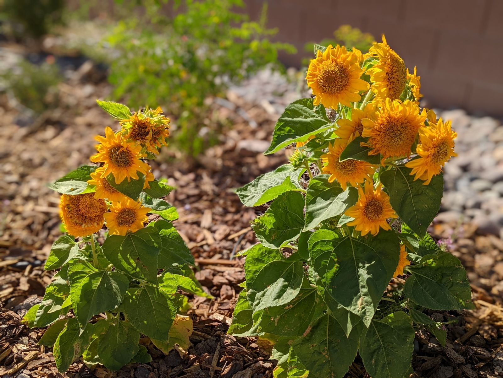
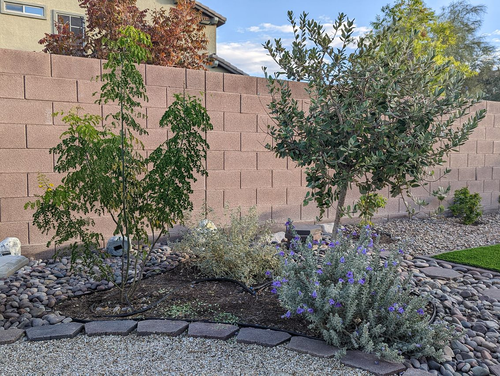

<a style=" padding: 0.5em; color: white; position: absolute; left:230px; top:460px; background-color: #00000088" href="https://en.wikipedia.org/wiki/Common_sunflower">
Sunflower "Dwarf Teddy Bear" 
<i>Helianthus annuus</i>
</a>

<a style=" padding: 0.5em; color: white; position: absolute; left:550px; top:230px; background-color: #00000088" href="https://en.wikipedia.org/wiki/Feijoa_sellowiana">
Feijoa  
<i>Feijoa sellowiana</i>
</a>
<a style=" padding: 0.5em; color: white; position: absolute; left:100px; top:100px; background-color: #00000088" href="https://en.wikipedia.org/wiki/Caesalpinia_pulcherrima">Mexican Bird of Paradise 
<i>Caesalpinia pulcherrima</i>
<a style=" padding: 0.5em; color: white; position: absolute; left:400px; top:460px; background-color: #00000088" href="https://en.wikipedia.org/wiki/Eremophila_hygrophana">Blue Bells Emu Bush 
<i>Eremophila hygrophana</i>

