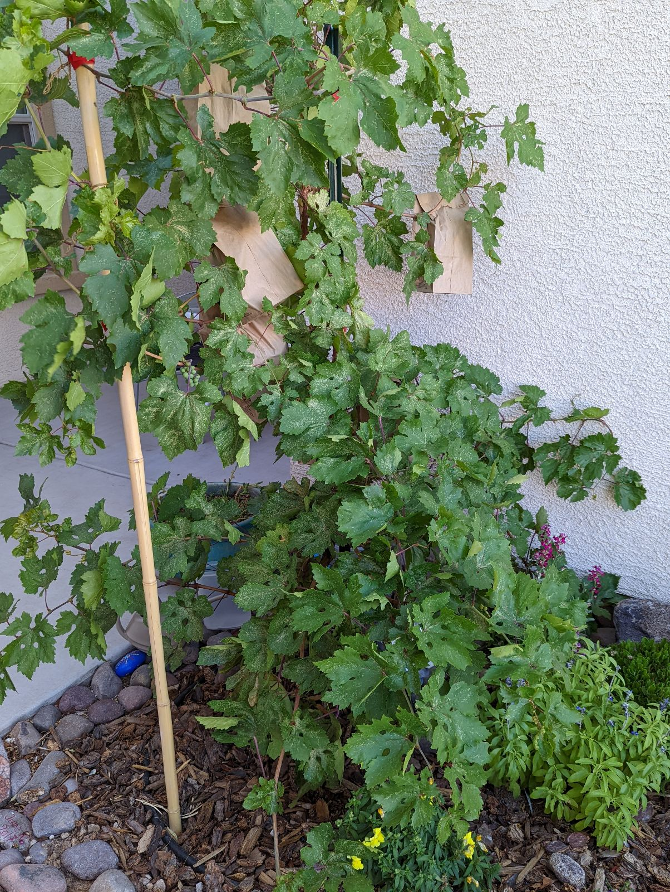
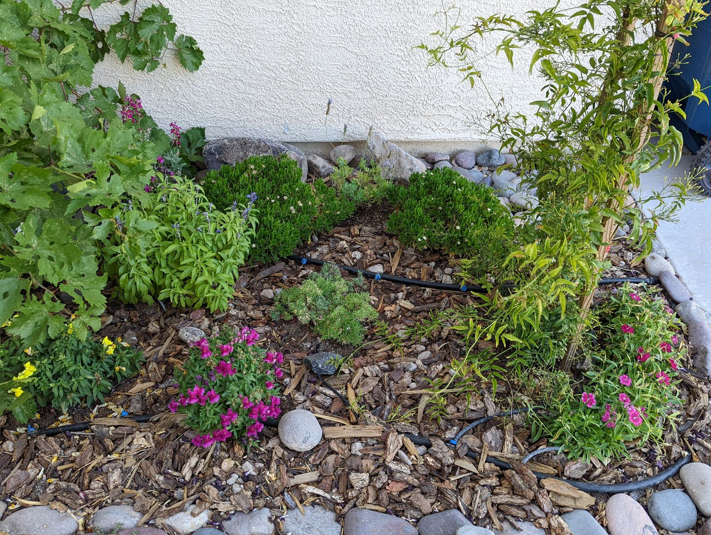

<a style=" padding: 0.5em; color: white; position: absolute; left:230px; top:460px; background-color: #00000088" href="https://en.wikipedia.org/wiki/Vitis_vinifera">
Grape "Red Flame" 
<i>Vitis Vinifera</i>
</a>

<a style=" padding: 0.5em; color: white; position: absolute; left:500px; top:30px; background-color: #00000088" href="https://en.wikipedia.org/wiki/Jasminum_polyanthum">
Chinese pink jasmine 
<i>Jasminum polyanthum</i>
</a>

