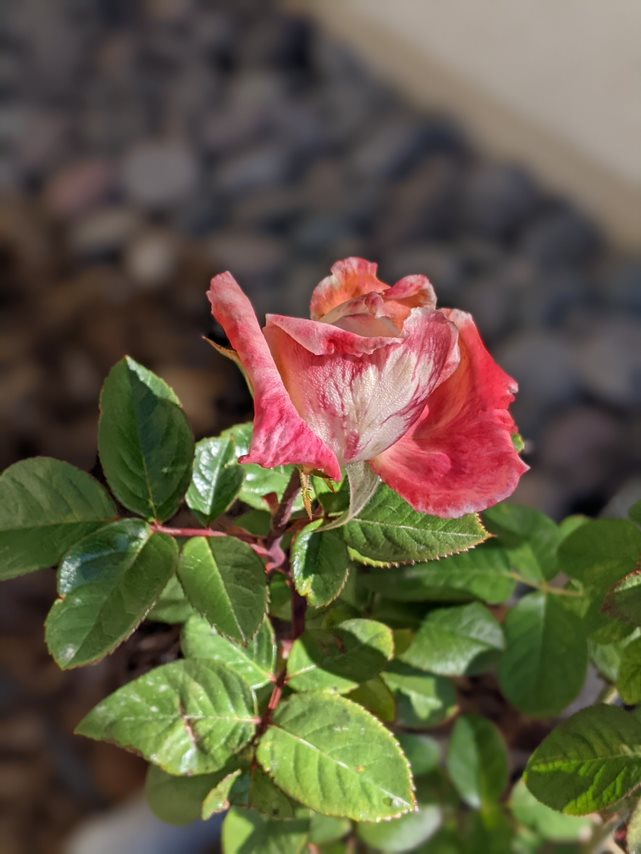
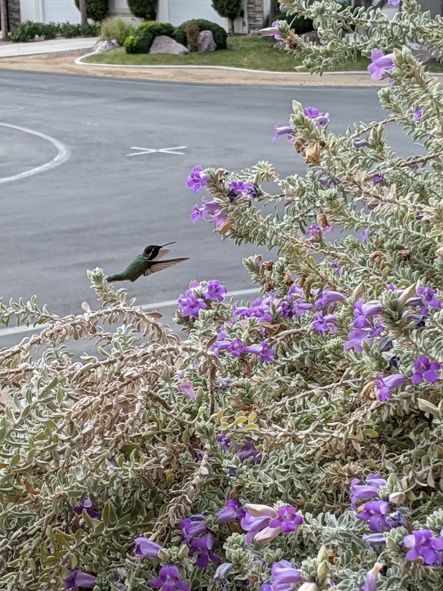

<a style=" padding: 0.5em; color: white; position: absolute; left:230px; top:460px; background-color: #00000088" href="https://en.wikipedia.org/wiki/Rose">
 Rose    
<i>Rosa</i> "Arizona"
</a>

<a style=" padding: 0.5em; color: white; position: absolute; left:230px; top:460px; background-color: #00000088" href="https://en.wikipedia.org/wiki/Eremophila_hygrophana">
Blue Emu Bush 
<i>Eremophila hygrophane</i>
</a>

